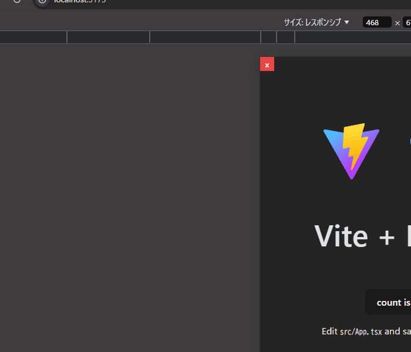

# React Responsive Helper 
The React library that helps you create responsive websites.

## Feature
- Provides a component that displays the current media query
- Supports `min-width` and `max-width`  
- Compatible with the default Tailwind CSS theme.

## Install
```
npm install -D react-responsive-helper
```

## Usage
Import the `Marker` component, insert it and set thresholds.
If you using the default Tailwind CSS, all you need to do is import and insert the `MarkerTailwind` component.
You can display a small marker at the corner of your screen, making it easier and faster when you create responsive websites. 



### Using `Marker`

```tsx
import { createRoot } from 'react-dom/client'
import App from './App.tsx'
import { Marker } from "react-responsive-helper";

createRoot(document.getElementById('root')!).render(
  <>
    <App />
    <Marker threshold={{
      'sm': null,          // always shown if other 
      'md': 640,           // shown when the display width is larger than 640px
      'lg': ['max', 1024]  // shown when the display width is smaller than 1024px 
    }} />
  </>,
)
```

### Using `MarkerTailwind`...

```tsx
import { createRoot } from 'react-dom/client'
import App from './App.tsx'
import { MarkerTailwind } from "react-responsive-helper";

createRoot(document.getElementById('root')!).render(
  <>
    <App />
    <MarkerTailwind />
  </>,
)
```

## License
MIT License

## Contribution
If you want to improve this library, please feel free to submit issues and pull requests.
